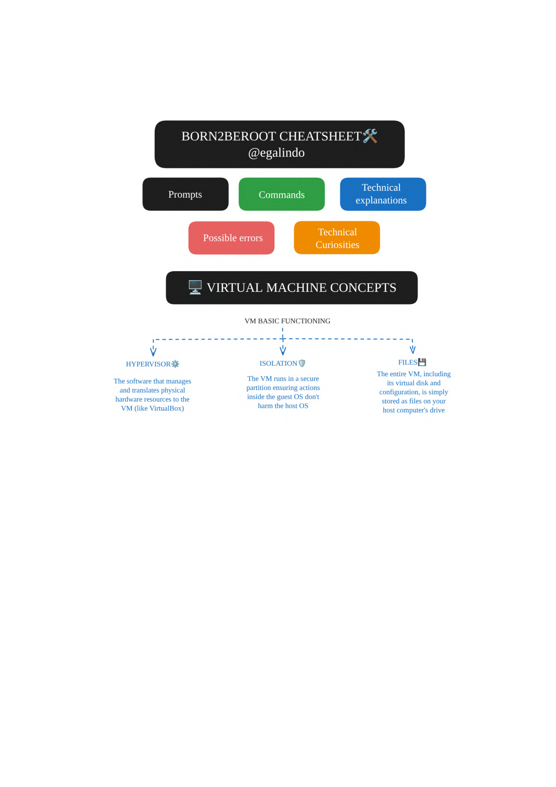
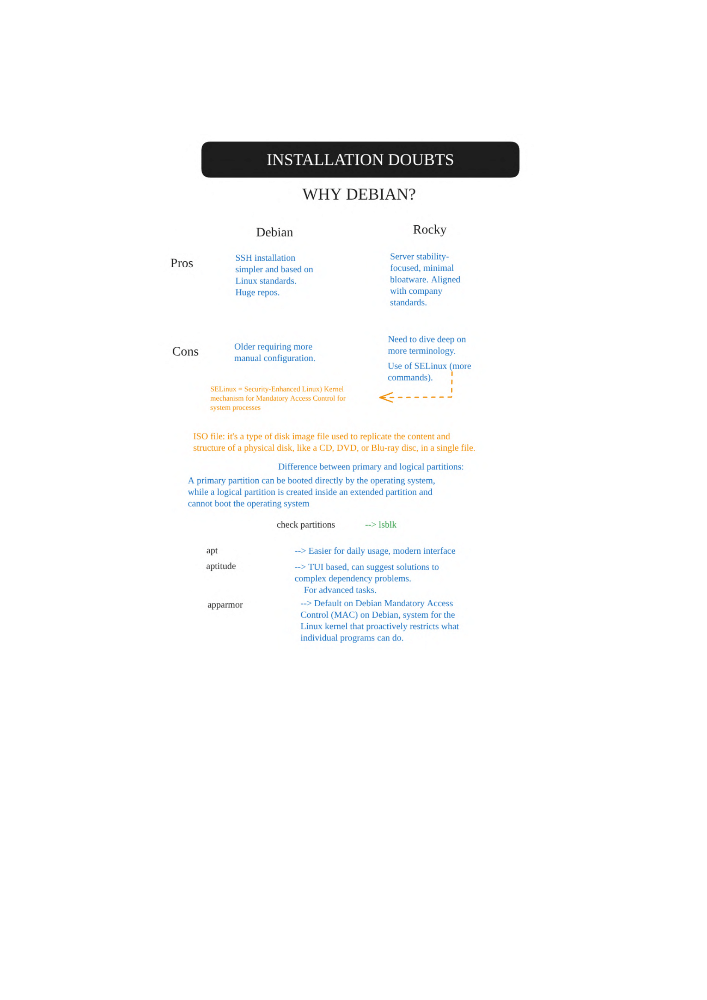
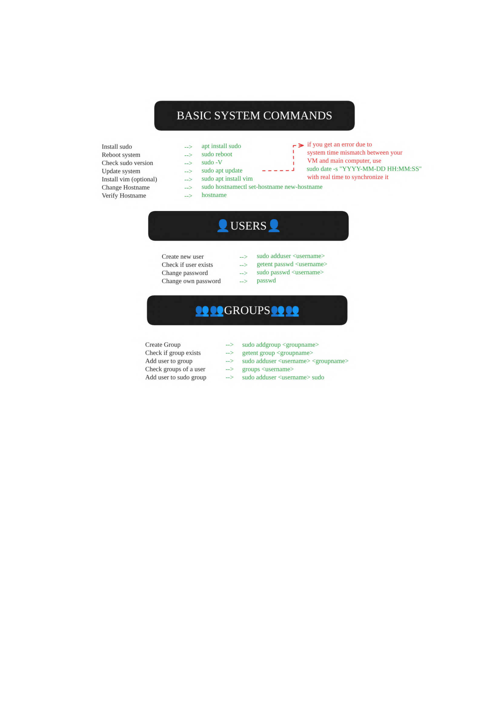
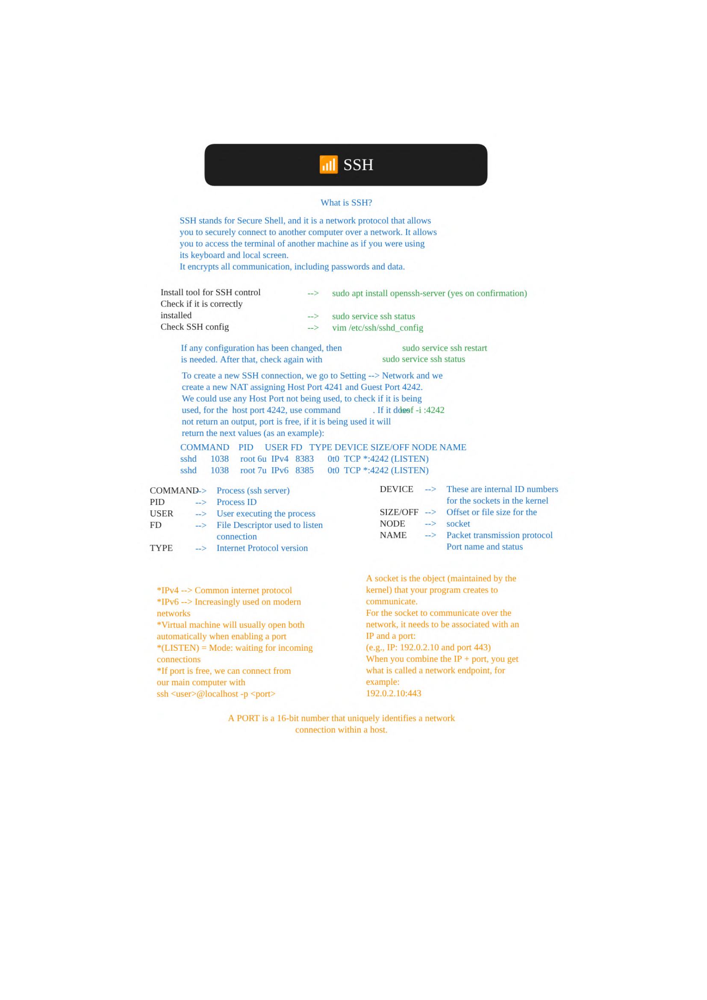
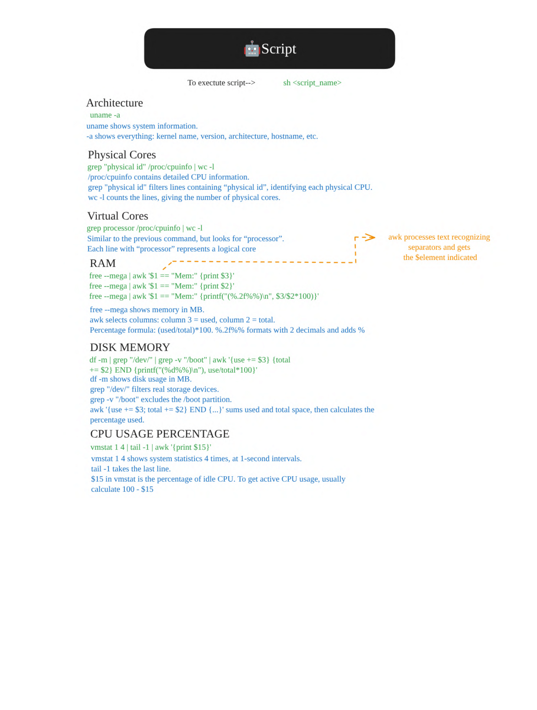

**This is a guide to better understand the 42 Born2beroot project. Some evaluators will let you have the cheatsheet during the correction while others will not, in any case, I hope it helps you!**

# 📚 Born2beroot Cheatsheet

---

---
